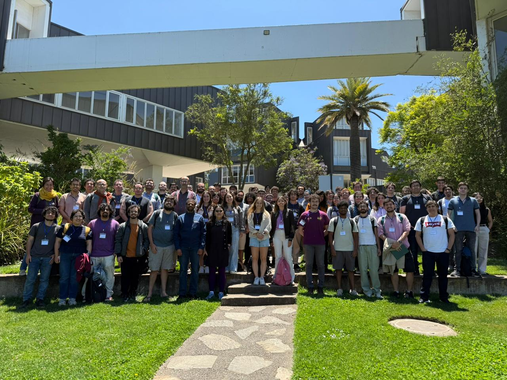

# Change Point Detection in Irregularly Sampled Time Series — AGN Light Curves Toy Example

Example application and replication code accompanying the presentation *Change Point Detection in Irregularly Sampled Time Series — AGN Light Curves Toy Example*. This repository provides a **teaching-oriented toy example** using the awakening AGN *ZTF19acnskyy* (SDSS J133519.91+072807.4): data are fetched from the IRSA ZTF Lightcurve API via the Astropy ecosystem, and changepoint detection (PELT) plus a piecewise trend+harmonic model are demonstrated.

## Context

This example was presented as a student talk at the **XXI Escuela de Verano en Matemáticas Discretas (Discretas 2026)**, held at the Universidad Adolfo Ibáñez campus in Viña del Mar, Chile. See the [participants list](https://eventos.cmm.uchile.cl/discretas2026/participantes/) and [programme (student talks)](https://eventos.cmm.uchile.cl/discretas2026/programa/) for additional context.

**Note:** This presentation and repository are intended as an **exploratory exercise** only. They are **not** part of any current formal investigation or research project.



---

## 1. Background: Change Point Detection

### 1.1 Motivation and scope

The analysis of changes—from everyday situations to physical or astronomical phenomena—has accompanied human development since its beginnings. Celestial observation was essential for calendars, climate, navigation, and culture; since then, the detection of changes has been central in biology, chemistry, physics, health, economics, social sciences, cybersecurity, finance, and many other fields. Change point detection (CPD) is the methodological framework for identifying when and how the statistical properties of a process change over time.

Terms such as **thresholds**, **segmentation**, **structural breaks**, **regime switching**, **breakpoints**, or **detecting disorder** are often used interchangeably with changepoint detection, depending on context and technique. One can distinguish between detecting a **single** versus **multiple** changepoints; the number of changes may be known in advance or estimated. In general, CPD targets changes in **mean**, **variance**, **correlation**, **distribution**, **regression structure**, or combinations thereof. Methods may assume known or unknown parameters; may be **Bayesian** or **frequentist**, **parametric** or **non-parametric**; and may be **online** (sequential, real-time) or **offline** (retrospective). **Structural break** detection is a particular case where the change is not only a shift but a change in the structure or parameters of the underlying model across regimes.

CPD is a central problem in statistical inference. It connects to parameter estimation, hypothesis testing, and both fixed-sample and sequential procedures. Typical goals are to decide whether a sequence is statistically homogeneous and, if not, to identify segments that are internally homogeneous and to estimate the number and locations of changepoints together with segment-specific parameters or distributions.

### 1.2 Applications

Changepoint detection is used in quality control and monitoring, healthcare, biology, neuroscience, climatology, economics, finance, geophysics, oceanography, cybersecurity, industry, and **astronomy**. In astronomy, CPD is used for segmenting time series and images, identifying transients (flares, eclipses, transits), correcting radial velocities for stellar activity, and separating distinct physical processes (e.g. AGN vs transients). It is also used to detect **state transitions in AGN**, such as nuclei switching between high and low activity, and to support the handling of large survey datasets. These applications often face **irregular sampling**, **seasonal gaps**, **low signal-to-noise**, and the need for **statistical control of false positives**.

### 1.3 Methodological evolution and challenges

The field has evolved from parametric to non-parametric methods, from offline to online settings, and from univariate to high-dimensional and complex data (networks, functional data). Algorithmic development—from CUSUM and dynamic programming to penalized segmentation (e.g. PELT) and machine-learning approaches—has been essential for scalability and applicability. Remaining challenges include:

- **Data**: Irregular sampling, temporal dependence, low signal-to-noise, seasonal gaps, graph or other complex structures.
- **Computation**: Scalability and efficiency for large or high-dimensional data.
- **Sensitivity–specificity**: Balancing detection power with control of false alarms.
- **Online vs batch**: Combining sequential detection with global (batch) optimization.
- **Robustness**: Outliers, missing data, non-stationarity.
- **Statistical guarantees**: Consistency, power, and computational bounds.
- **Interpretability**: Linking detected changepoints to causal or physical mechanisms.

This repository does not implement new methodology; it provides a **minimal, reproducible example** of applying existing tools (PELT, piecewise regression) to an astronomical time series, using open data and the Astropy ecosystem, suitable for teaching and replication. The implementation uses **PELT** (ruptures) for segmenting the light curve (change in mean, variance, and mean & variance) and **classical Binary Segmentation** for the piecewise model; each segment is modeled with **quadratic + harmonic regression**. Methods are standard and widely used in time series analysis.

For definitions, formal problem statement, PELT, and a detailed toy-workflow description, see **[theoretical_background_v3.md](theoretical_background_v3.md)**.

---

## 2. Guidelines for the Toy Example

### 2.1 Repository structure

```
├── README.md
├── LICENSE
├── citation.cff
├── .zenodo.json
├── requirements-astropy.txt
├── img/                         # Repo images (e.g. for README)
├── scripts/
│   └── plots_astropy.py         # Fetch data, PELT + piecewise, save figures
├── presentation/
│   ├── main.tex, main.pdf       # Beamer (OsloMet theme) + compiled PDF
│   ├── bib.bib
│   ├── img/                     # Slide figures (generated by script + your images)
│   └── *.sty                    # Beamer theme
└── theoretical_background_v3.md # Theoretical companion (definitions, PELT, toy workflow)
```

### 2.2 Requirements

- **Python 3** with:
  - `astropy` (Time, TimeSeries, SkyCoord, Table; used to fetch and hold the light curve)
  - `numpy`, `matplotlib`
  - `ruptures` (PELT changepoint detection)
- **LaTeX** (optional): to compile the presentation (`pdflatex` + `bibtex`).

Install Python dependencies:

```bash
pip install -r requirements-astropy.txt
```

### 2.3 Data source

The toy example uses the **g-band light curve of ZTF19acnskyy** (SDSS J133519.91+072807.4), the “awakening” AGN. Data are **fetched at run time** from the [IRSA ZTF Lightcurve API](https://irsa.ipac.caltech.edu/docs/program_interface/ztf_lightcurve_api.html) by sky position (no local CSV required). The script uses Astropy’s `SkyCoord`, `Table.read()` (IPAC format), and `TimeSeries`; only standard library HTTP is used for the request.

### 2.4 Running the example

From the **repository root**:

```bash
python scripts/plots_astropy.py
```

This will:

1. Fetch the ZTF g-band light curve from IRSA for the object’s coordinates.
2. Generate five figures in **`presentation/img/`**:
   - **change-point-types.png**, **change-in-mean.png**, **change-in-variance.png**, **change-in-mean-variance.png**, **piecewise-models.png**.

The presentation references these from `presentation/img/`. To compile the PDF, from **`presentation/`**:

```bash
cd presentation
pdflatex main
bibtex main
pdflatex main
pdflatex main
```

### 2.5 What the example illustrates

- **Data access**: Using a public survey API (IRSA) and Astropy for coordinates and time series.
- **Changepoint types**: Simulated mean, variance, and mean+variance changes (teaching panel).
- **PELT**: Offline detection with ruptures (change in mean with L2 cost; change in variance on centered data; change in mean & variance with normal cost).
- **Piecewise model**: Binary segmentation (adaptive-pooled) + same parametric form (trend + one harmonic) per segment—a generic formulation for teaching.

The script is kept short and readable for teaching; it is not a production pipeline.

---

## 3. Citation and Academic Note

### 3.1 How to Cite

If you use this repository for teaching, replication, or derivative work, please cite the Zenodo release (once published). For example:

```text
Vergara Silva, C. L. (2026). *Change Point Detection in Irregularly Sampled Time Series: AGN Light Curves Toy Example* (1.0.0). Zenodo. https://doi.org/10.5281/zenodo.18779915
```


### 3.2 Acknowledgments

- **Event funding:** This event was funded by the Center for Mathematical Modeling (CMM — Centro de Modelamiento Matemático) through its ANID FB210005 Basal Project. Grateful acknowledgment to the academic spaces that support student research and scholarly exchange. See [CMM](https://www.cmm.uchile.cl/) and the [Discretas 2026](https://eventos.cmm.uchile.cl/discretas2026/) event.
- **AI-assisted development**: Parts of the code and documentation were improved with AI-based tools in **Cursor** (Cursor IDE, [cursor.com](https://cursor.com)).
- **PELT and changepoint methods**: The use of PELT and the changepoint workflow in this example was informed by the *Introduction to Changepoint Analysis* workshop (Rebecca Killick, CASI 2024): [IntroCptWorkshop.Rmd](https://github.com/rkillick/intro-changepoint-course/blob/master/IntroCptWorkshop.Rmd) (R `changepoint`, `changepoint.np`, PELT, BinSeg, and related material).

---

*Author: Cinthya Leonor Vergara Silva. Presentation theme: OsloMet Beamer
